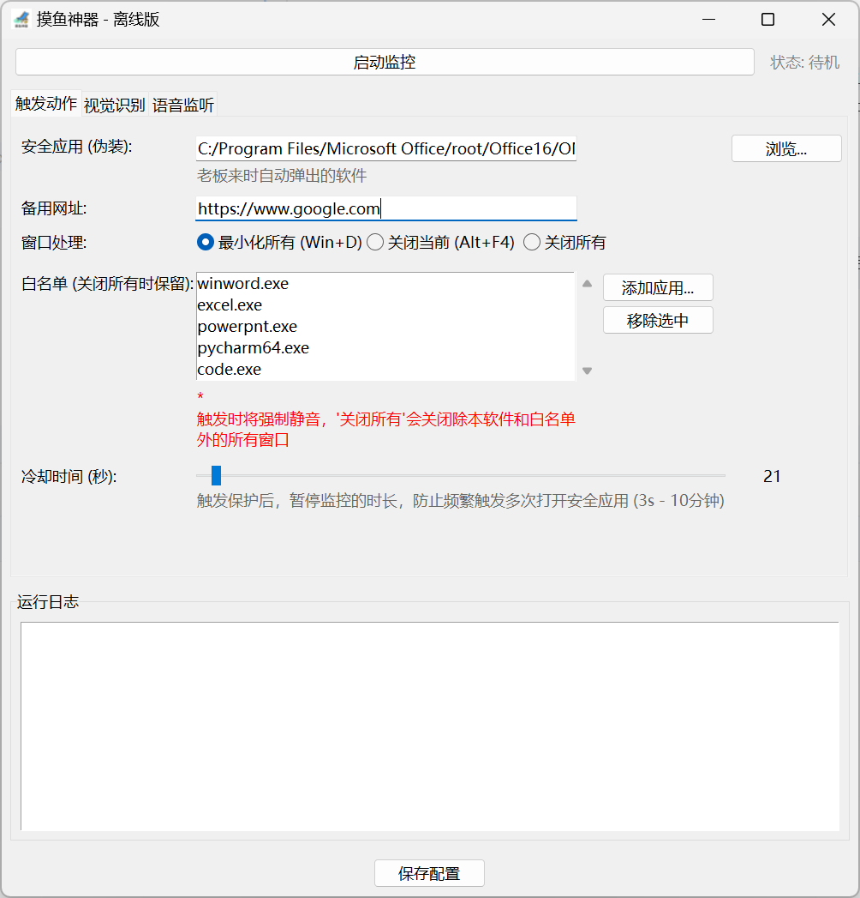
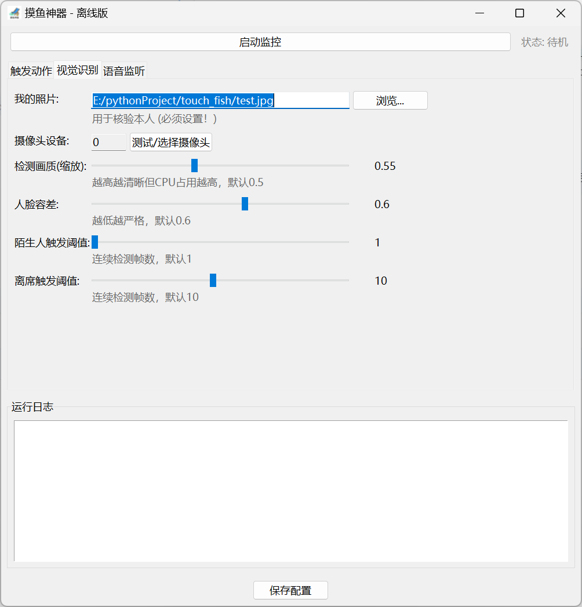
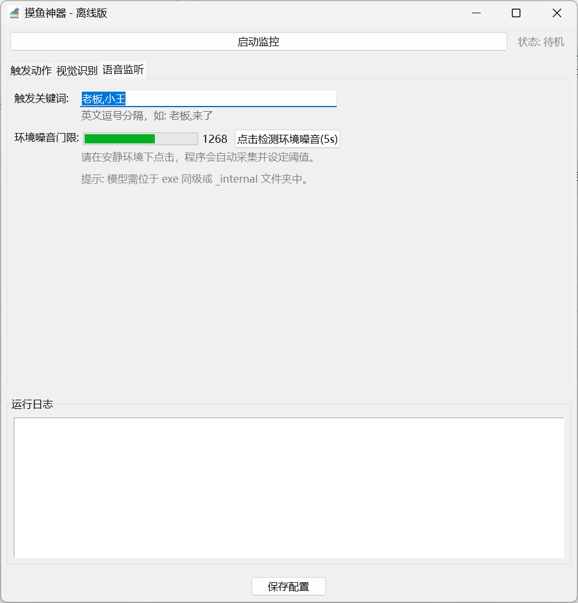
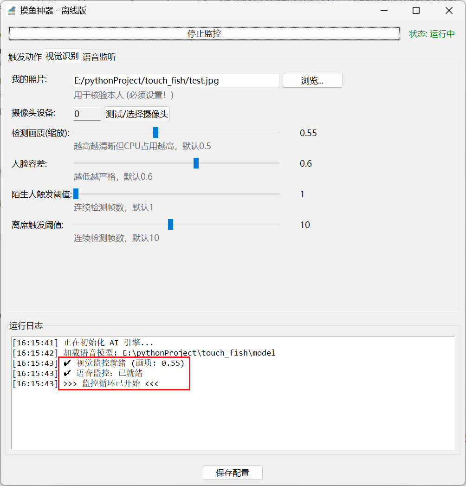

<div align="center">  <h1>🐟 TouchFish (摸鱼神器)</h1> <p> <strong>基于 AI 视觉与语音识别的智能办公隐私保护系统</strong> </p>

</div>

## 📖 项目简介
**TouchFish** 是一款专为打工人设计的桌面隐私保护工具。它利用计算机视觉（CV）和离线语音识别（ASR）技术，实时监控用户周围环境。

当检测到 **陌生人靠近**、**用户离席** 或 **听到特定语音关键词**（如“老板来了”）时，系统会毫秒级响应：自动静音、隐藏娱乐窗口，并瞬间全屏切换至工作界面（如 Word/Pycharm等），全方位守护你的“摸鱼”时刻。

> **核心优势**：完全离线运行，无需联网，绝不上传任何视频或音频数据，安全隐私有保障。

## ✨ 核心功能
* **👁️ 视觉监控 (严格单人模式)**
  * **人脸核身**：只认主人的脸，非本人操作立即锁定。
  * **防窥检测**：即使是本人，只要检测到**多人同框**（如身后有人偷看），立即触发保护。
  * **离席检测**：检测到座位无人时，自动触发保护。
  * **画质调节**：支持动态调整检测分辨率，兼容低配电脑。
* **👂 语音监听 (离线识别)**
  * 基于 **Vosk** 引擎的离线语音识别。
  * 支持自定义关键词（如：`老板`, `开会`, `小王`）。
  * **环境噪音频自适应**：内置环境噪音检测功能，自动设定触发门限。
* **🛡️ 强力保护动作**
  * **系统级静音**：直接调用 Windows API 静音，防止游戏声音外放。
  * **智能清场**：支持 **白名单机制**，可配置“关闭所有应用”，仅保留白名单内的办公软件。
  * **伪装现场**：触发后自动 **全屏最大化** 启动指定的安全应用（如 Excel）。
* **❄️ 智能冷却**
  * 触发保护后自动进入冷却模式（默认 10秒），防止因持续检测造成的窗口鬼畜切换。

## 📦 快速开始 (普通用户)
1. 在 [Releases](https://www.google.com/search?q=%E4%BD%A0%E7%9A%84Github%E5%8F%91%E5%B8%83%E9%A1%B5%E9%93%BE%E6%8E%A5 "null") 页面下载最新的压缩包 `TouchFish_v1.0.0.zip`。
2. 解压到任意文件夹（**必须解压**，不能在压缩包内运行，路径中不能出现中文）。
3. 双击 `TouchFish.exe` 运行。
4. **首次配置**：

📸 **第一步：录入您的“面容ID”**
> 软件需要知道“谁是主人”，否则出于安全考虑，摄像头将拒绝启动。
1.  点击软件顶部的 **【视觉识别】** 选项卡;
2. 点击“我的照片”旁的 **【浏览...】** 按钮，选择一张您的照片（证件照、生活照均可，需五官清晰）；
3. 点击“摄像头设备”后面的【测试/选择摄像头】按钮，系统会自动检测您当前所有可用的摄像头，选择一个合适的摄像头后点击 **【确认使用此设备】**；
4. 移动“检测画质(缩放)”滑块，根据您的电脑配置调整到合适的数值（建议 0.5\~0.8），数值越大，识别越精准，但也会占用更多系统资源；
5. 移动“人脸容差”滑块，根据您的环境调整到合适的数值（建议 0.55\~0.65），数值越小，识别越精准，但也会增加误识别风险；
6. 移动“陌生人触发阈值”滑块，设置检测到摄像头内出现陌生人多少帧数触发安全切换，数值越小，触发越敏感，但也会增加误识别风险；
7. 移动“离席查发阈值”滑块，设置检测到摄像头内本人多少帧数未出现即触发安全切换； 
8. 点击底部的 **【保存配置】**，系统会记住您本次设置，下次打开后自动加载上次的配置参数。

🎭 **第二步：设置“伪装现场”**
> 当危险来临时，您希望电脑屏幕变成什么样？
1. 点击 **【触发动作】** 选项卡；
2. **安全应用(伪装)**：选择一个您期望触发安全切换时打开的工作软件（如 Word, 代码编辑器, 本地文档等）；
   * *效果*：触发安全切换时，该软件会自动弹窗全屏遮挡屏幕；
3. **备用网址**：当您的安全应用因为某些异常无法正常打开时，您可以配置一个备用网址（如 `https://www.baidu.com`），系统会在触发保护时打开该网址；
4. **窗口处理**：可选择 **“最小化所有 (Win+D)”**, **“关闭当前（Alt + F4）”** 和 **“关闭所有”**；
   * *效果*：触发安全切换时，根据您的选择，会最小化所有窗口 / 关闭当前活动窗口 / 关闭除 本应用 及 添加到白名单内的应用 以外的所有窗口；
5. **白名单**：仅在选择 **“关闭所有”** 时生效，会自动排除掉在白名单内的应用；
6. **冷却时间**：触发保护后自动进入冷却模式（默认 10秒），防止因持续检测造成的窗口鬼畜切换，支持配置3s\~600s(10min)；
7. 点击底部的 **【保存配置】**，系统会记住您本次设置，下次打开后自动加载上次的配置参数。

👂 **第三步：设置语音监听**
> 当老板或其他同事喊你的名字或者特定关键词时，自动触发保护。
1. 点击 **【语音监听】** 选项卡；
2. **触发关键词**：输入如 `老板,小王,开会`等语音关键词，多个关键词之间用英文逗号隔开，一旦麦克风听到这些词，立即触发保护；
3. **环境噪音频门限**：内置环境噪音检测功能，点击 **【检测环境噪声(5s)】** 后，系统将自动检测 5s 内环境的最大噪声作为语音触发门限，无需手动调整； 
4. 点击底部的 **【保存配置】**，系统会记住您本次设置，下次打开后自动加载上次的配置参数。

❄️ **关于“冷却时间”的具体解释**
为了防止电脑“抽风”，当保护触发后，软件会进入冷却期，此期间内应用将 **不再监控** 摄像头和麦克风，避免持续触发保护，打开多个重复界面。
在期间内，您可以用这段时间调整坐姿、关闭不需要的窗口，等待风险过去后再重新启动监控。

❓ **常见问题 (Q&A)**
**Q: 为什么点击“启动监控”没反应，或者摄像头灯不亮？**
> **A**: 请检查日志区域。通常是因为**未设置用户照片**。软件必须加载照片后才会启动摄像头。

**Q: 为什么我坐在电脑前，它也报警说有“陌生人”？**
> **A**: 本软件采用**严格单人模式**。
> 请检查身后是否有其他人（多人同框 = 危险）。
> 请检查光线是否太暗，或人脸容差设置过低。

**Q: 语音功能提示“找不到模型”？**
> **A**: 请确认 `TouchFish.exe` 同级目录下存在 `model` 文件夹，且并未修改其内部结构。

**Q: 关闭软件时，为什么界面卡顿了一下？**
> **A**: 这是正常现象。后台的 AI 线程正在安全释放摄像头和麦克风资源，请耐心等待 1-2 秒。

## 🛠️ 开发与源码运行 (开发者)
如果你想自己修改代码或编译，请按以下步骤操作：

### 1. 环境准备
推荐使用 Python 3.9+ 虚拟环境：
```bash
python -m venv venv
.\venv\Scripts\activate
```

### 2. 安装依赖
```bash
pip install -r requirements.txt
```
*注意：Windows 下 `dlib` 安装可能会报错，建议下载对应的 `.whl` 文件进行安装。*

### 3. 下载模型文件 (重要!)
本项目依赖两个开源模型，请下载并按下述结构放置：
1. **语音模型 (Vosk Small CN)**:
   * 下载地址: [vosk-model](https://alphacephei.com/vosk/models "null")，请在 Model list 中选择 `vosk-model-small-cn-0.22`(轻量，但语音识别准确率稍差) 或 `vosk-model-cn-0.22`(体积更大，但语音识别准确率更大)，请根据自己需求进行下载。当前项目已默认下载了 `vosk-model-small-cn-0.22` 模型，如有需要可自行进行模型更换。
   * 解压并将文件夹重命名为 `model`，放在项目根目录。
   * 确保结构为: `model/conf/model.conf` ...
2. **人脸识别模型 (Dlib)**:
   * `face_recognition` 库通常会自动下载，如需手动配置，请参考 `face_recognition_models` 的官方说明。

### 4. 运行
```bash
python main_gui.py
```

### 5. 打包生成 EXE
```bash
pyinstaller build.spec
```

## 🖼️ 界面预览

| 设置界面                      |
|---------------------------|
|  |
|  |
|  |
|  |

## ⚠️ 免责声明
本软件仅供技术研究与学习交流使用。开发者不提倡也不鼓励在工作时间进行违反公司规定的行为。因使用本软件导致的任何后果（包括但不限于被解雇、绩效扣除等），开发者不承担任何责任。

**摸鱼千万条，安全第一条。**

## 📄 开源协议
本项目采用 [GNU Affero General Public License v3.0 (AGPL-3.0)](https://opensource.org/licenses/AGPL-3.0) 开源。

**Copyright (c) 2026 [Mr. Chen]**